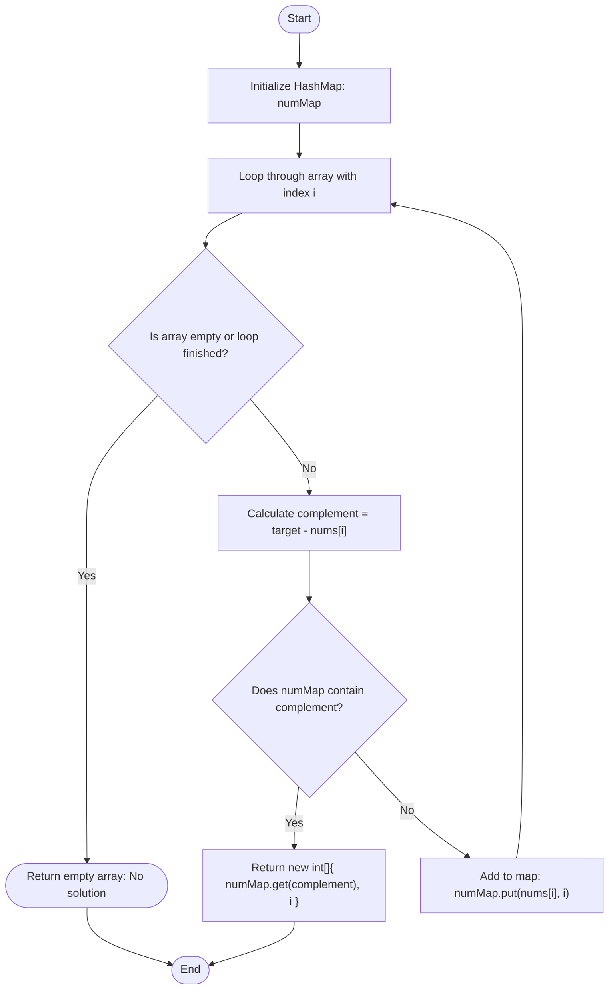

# Two Sum Algorithm in Java

This note contains a functional implementation of the Two Sum algorithm, which can be executed interactively using the **Code Emitter** plugin.

### 1. Algorithm Flowchart
Here is the visual logic of how the Hash Map approach solves the Two Sum problem in $O(n)$ time complexity.



### 2. Interactive Java Code
Click the **Run / Play button** added by Code Emitter at the top right of the code block below to execute the code and see the terminal output.

```java
import java.util.HashMap;
import java.util.Arrays;

public class Main {
    public static int[] twoSum(int[] nums, int target) {
        // Map to store numbers and their corresponding array indices
        HashMap<Integer, Integer> numMap = new HashMap<>();
        
        for (int i = 0; i < nums.length; i++) {
            int complement = target - nums[i];
            
            // If complement is found, return its index and current index
            if (numMap.containsKey(complement)) {
                return new int[] { numMap.get(complement), i };
            }
            
            // Otherwise, store the current number and index in the map
            numMap.put(nums[nums[i], i);
        }
        
        return new int[] {}; // Return empty array if no solution is found
    }

    public static void main(String[] args) {
        int[] nums = {2, 7, 11, 15};
        int target = 9;
        
        int[] result = twoSum(nums, target);
        
        System.out.println("Input Array: " + Arrays.toString(nums));
        System.out.println("Target Sum: " + target);
        System.out.println("Indices Found: " + Arrays.toString(result));
    }
}
```
