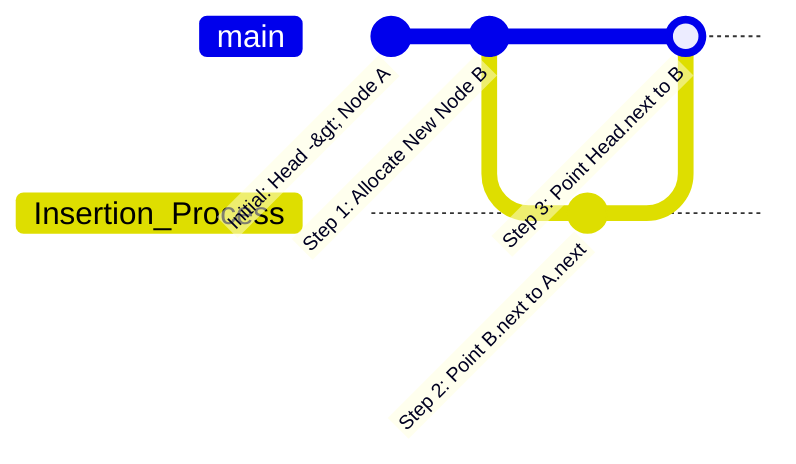

```mermaid
gitGraph
    commit id: "Initial: Head -> Node A"
    commit id: "Step 1: Allocate New Node B"
    branch Insertion_Process
    checkout Insertion_Process
    commit id: "Step 2: Point B.next to A.next"
    checkout main
    merge Insertion_Process id: "Step 3: Point Head.next to B"
```
